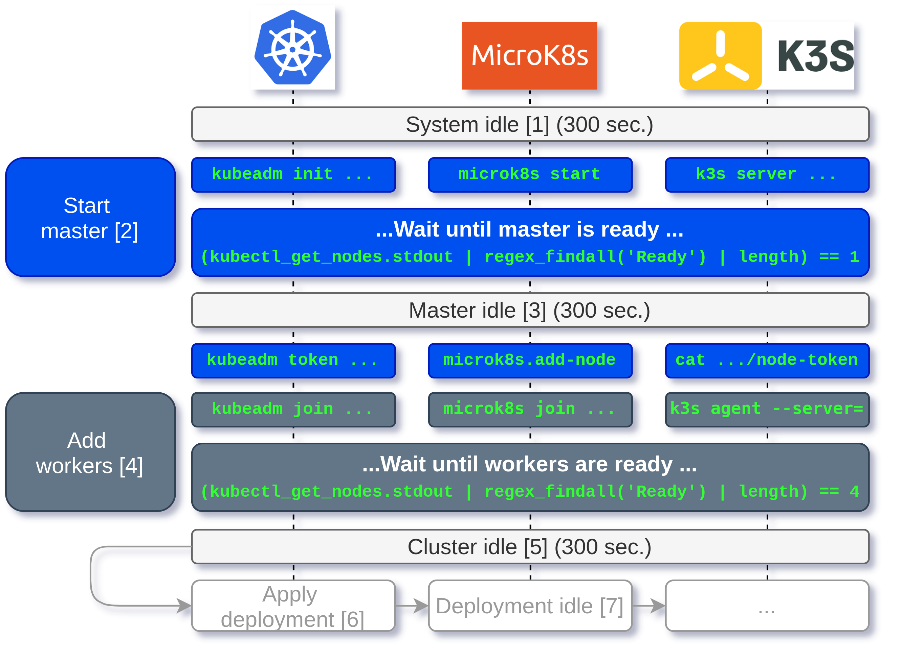
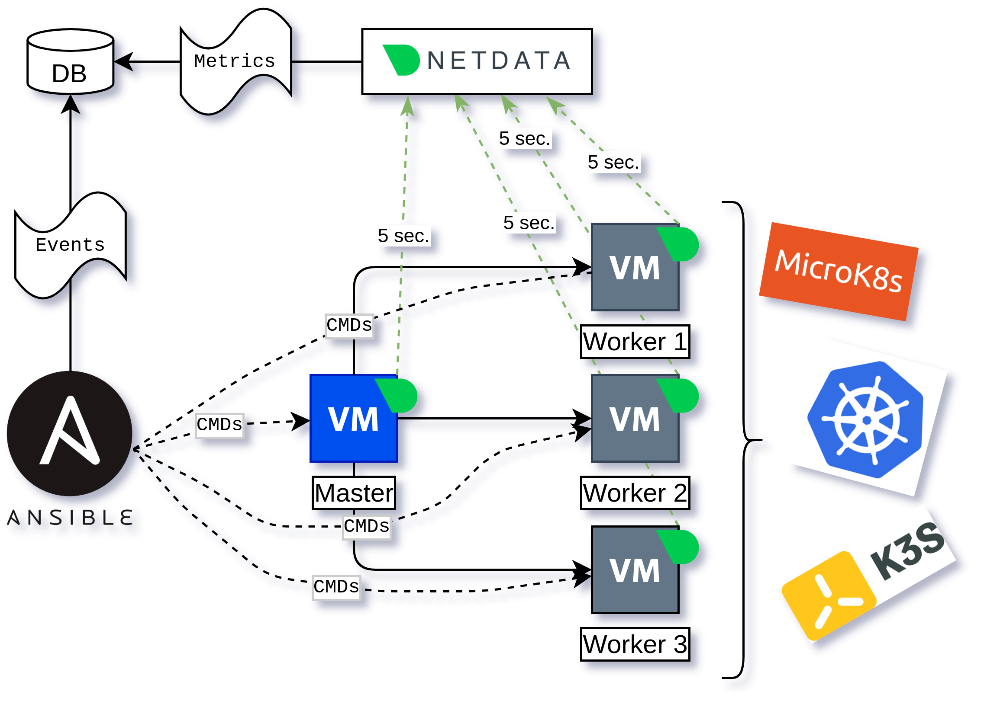

# KNS-Profiling

## What is KNS-Profiling?

This repository contains all necessary components to perform an automated lifecycle analysis with KNS platforms.
A KNs platform is a Kubernetes-compatible container orchestration platform, like MicroK8s from Canonical and K3s maintained by Rancher.

This software project allows to simulate the lifecycle of a Kubernetes-platform entirely by monitoring the resource and time consumption of typical steps in cluster a lifecycle (like start master, joining/draining nodes).

The experiment is conducted by predefined ansible playbooks, which are located under `ansible/simulate-***.yaml`.
During the experiment, different tasks that the playbook is referring to store events into a mongodb instance in order to measure the resource and time consumption.
So far, we support the platforms Kubernetes, MicroK8s, and K3s.

The following figure visualizes how the implementation is working:



The experiment can be parametrized as follows. 

```yaml
  vars: 
    platform: "K3s"
    K3S_VERSION: v1.20.0+k3s2
    SIMULATION_WAIT_INTERVAL: "30" # paused time between tasks
    SIMULATION_IDLE_INTERVAL: "300" # time taken for measuring the idle utilization 
    SIMULATION_END_INTERVAL: "1000" # additional time after the experiment has been completed 

```

Furthermore, we can define the number of runs for the simulation:

```yaml
- include_tasks: profiling-k3s.yaml
    with_sequence: start=3060 end=3079 stride=1
    loop_control:
    loop_var: simulation
```

This will repeat the experiment 10 times.

## Tool Architecture



## How to Deploy the Profiling Tool?

tbd.

## How to Analyze the Obtained Data?

tbd.